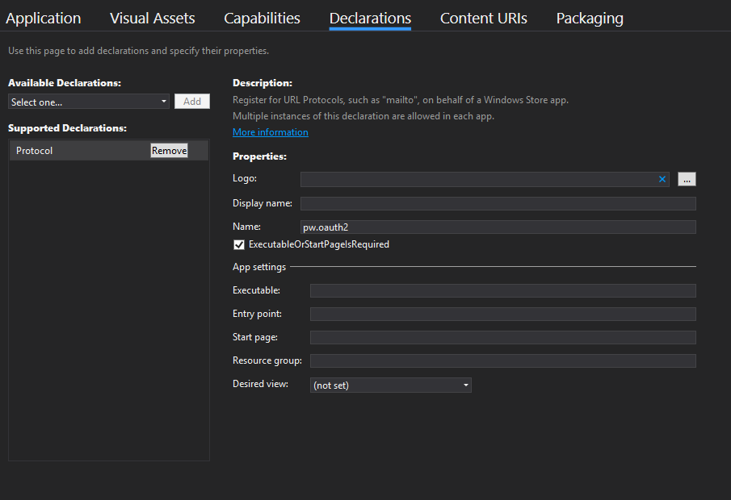

About the library
-----------------
Whole implementation is based on google example. It just wrapps it into simpler code. You can find details about this implementation in google samples repository.

The protocols referenced in this sample are documented here:
- [google example](https://github.com/googlesamples/oauth-apps-for-windows)
- [OAuth 2.0](https://developers.google.com/identity/protocols/OAuth2)
- [Using OAuth 2.0 for Mobile and Desktop Applications](https://developers.google.com/identity/protocols/OAuth2InstalledApp)

Requirements
------------
This UWP library only works on windows with Microsoft.NETCore.UniversalWindowsPlatform (minimal ver 6.1.9)
Your UWP should support Fall Creators Update (to be set in project preferneces)

How to use it
-------------
Add Galcorp.Auth.UWP nuget to your Universal Windows project

Add this line to your **App.xaml.cs** code

```
protected override void OnActivated(IActivatedEventArgs args)
{
    Galcorp.Auth.UWP.AppEventWrapper.OnApplicationActivationEvent(args);
}
```

To perform login u can use this code (it will give you token)
```
string clientID = "some-googleauthverycomplicatedurl.apps.googleusercontent.com";
string redirectURI = "pw.oauth2:/oauth2redirect";

new Thread(new ThreadStart(delegate
{
    var a = new UWPWrapper(clientID, redirectURI);
    var c = a.Login().Result;
})).Start();
```

This thread is needed if you will attach this action to the GUI Button. Thread is need to wait asynchorunsly for a browser call back to be handled

You need also to register protocol in your UWP application and in google your protocol name could be somthing like this: 
`pw.oauth2`. To access protocol you need to open application manifest setting in project properties page.


Use nuget **Galcorp.Auth** for some interfaces that will allow to move login logic to your net standard libraries.

Setup Google Service
--------------------

The Sample comes backed with some demo client credentials, which are fine for
testing, but make sure you use your own credentials before releasing any app,
or sharing it with friends.

1. Visit the [Credentials page of the Developers Console](https://console.developers.google.com/apis/credentials?project=_)
2. Create a new OAuth 2.0 client, select `iOS` (yes, it's a little strange to
select iOS, but the way the OAuth client works with UWP is similar to iOS, 
so this is currently the correct client type to create).
3. As your bundle ID, enter your domain name in reverse DNS notation. E.g.
if your domain was "example.com", use "com.example" as your bundle ID.
Note that your bundle ID MUST contain a period character `.`, and MUST be
less than 39 characters long
4. Copy the created client-id and replace the clientID value in this sample
5. Edit the manifest by right-clicking and selecting "View Code" (due to a
limitation of Visual Studio it wasn't possible to declare a URI scheme
containing a period in the UI).
6. Find the "Protocol" scheme, and replace it with the bundle id you registered
in step 3. (e.g. "com.example")

License
-------------


Licensed under the Apache License, Version 2.0 (the "License"); you may not use this file except in compliance with the License. You may obtain a copy of the License at

http://www.apache.org/licenses/LICENSE-2.0

Unless required by applicable law or agreed to in writing, software distributed under the License is distributed on an "AS IS" BASIS, WITHOUT WARRANTIES OR CONDITIONS OF ANY KIND, either express or implied. See the License for the specific language governing permissions and limitations under the License.
